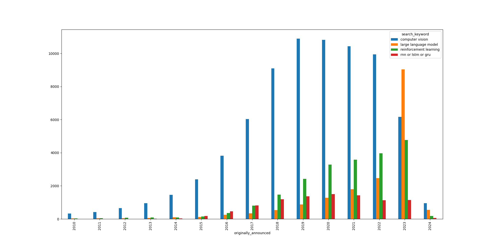

# Analyzing Trends on the `arXiv` Website

## Introduction

### Purpose: Analyzing Trends on the `arXiv` Website

As a researcher, staying abreast of the latest trends and developments in your field is crucial. While the arXiv website serves as a vital repository for this purpose, discerning emerging trends from the volume of publications can be challenging. This analysis aims to survey the proliferation of papers across various keywords, providing a data-driven overview of evolving research interests and technological advancements.

### data structure:
```python
class ArxivResult:
    id: int
    title: str
    authors: T.List[str]
    link: str
    tags: T.List[str]
    originally_announced_at: str

class ConcatedArxivResult:
    id_for_search_keyword: int
    title: str
    authors: T.List[str]
    link: str
    tags: T.List[str]
    search_keyword: str
    submitted: str
    originally_announced: str
```
`ArxivResult`: Represents individual search results, encapsulating metadata such as title, authors, and publication date. This structure is pivotal for analyzing trends within specific research domains.  

`ConcatedArxivResult`: A composite format that combines results across different search queries. This structure is instrumental in cross-comparing the prevalence of various keywords over time, facilitating a comprehensive trend analysis.

## Analysis


The analysis reveals a notable shift in research focus areas, particularly with the advent of deep learning architectures and the subsequent rise of large language models (LLMs) and reinforcement learning techniques. Key observations include:  

`2015 Milestone`: The introduction of ResNet marked a significant advancement in deep learning, catalyzing the development of deeper, more efficient models. (Computer Vision graph!)  

`2022-2023 LLM Surge`: The emergence of ChatGPT in 2023 and its widespread recognition underscored a dramatic increase in LLM-related research, highlighting the technology's transformative potential.  

`Decline of Traditional RNN-Based Models`: Once staples in natural language processing, RNNs, LSTMs, and GRUs have seen a decline in prominence, overshadowed by the versatility and efficacy of LLMs.

## Methodological Insights
### Fast, Efficient Data Scraping with Multi-Threading

I employed multi-threading to expedite the data collection process, distributing queries across multiple threads to parallelize downloads and significantly reduce scraping time. While effective, this approach necessitates careful rate management to avoid overloading server resources or triggering IP bans.

```python
...

queues = [queue.Queue() for _ in range(N_THREADS)]
threads = []

for i in range(N_THREADS):
    thread = th.Thread(target=get_arxiv_results, args=(YEAR, search_idx, item_idx, TERMS, queues[i]))
    thread.start()
    threads.append(thread)

    ...

...
```

### Ensuring Robust Development with Type Hints

Type hints were extensively used to fortify the development process, enhancing code readability and reducing the likelihood of runtime errors. This practice was instrumental in ensuring the stability and reliability of my scraping tools, contributing to a smoother, more efficient data analysis workflow.

- `class`, `import typing as T`, ...

## Conclusion
This analysis has made it evident that the intrigue surrounding large language models (LLMs) predated the public's fascination with ChatGPT, highlighting a significant trend within the research community. This realization emphasizes the importance of trend analysis in not only understanding the present but also in anticipating the future. Witnessing the gradual ascent of LLMs in research has reinforced my belief in the power of such analyses to prepare us for upcoming technological shifts. It's a compelling reminder that by staying informed about research trends, we can better navigate the evolving landscape of scientific inquiry and technological innovation.